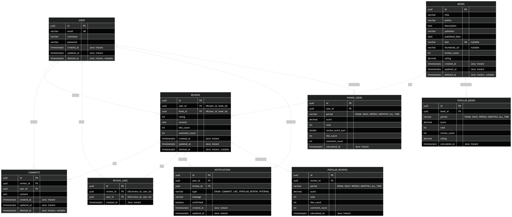

# 📚 덕후감

> 책 읽는 즐거움을 공유하고, 지식과 감상을 나누는 책 덕후들의 커뮤니티 서비스

[](https://github.com/5ooooooj/sb11-deokhugam-team3/actions/workflows/ci.yml)
[](https://codecov.io/gh/5ooooooj/sb11-deokhugam-team3)
<br>

## 📋 목차

- [서비스 소개](#서비스-소개)
- [팀원](#팀원)
- [기술 스택](#기술-스택)
- [주요 기능](#주요-기능)
- [아키텍처](#아키텍처)
- [ERD](#erd)
- [API 명세](#api-명세)
- [로컬 실행 방법](#로컬-실행-방법)
- [컨벤션](#컨벤션)

<br>

## 서비스 소개

**덕후감**은 도서 이미지 OCR 및 ISBN 매칭을 기반으로 한 책 커뮤니티 서비스입니다.

카메라로 책 표지를 찍으면 ISBN을 자동 인식하고, Naver Book API를 통해 도서 정보를 자동으로 불러옵니다.
도서에 리뷰와 댓글을 남기고, 인기 도서·리뷰·파워 유저 대시보드를 통해 다른 독자들의 활동을 확인할 수 있습니다.

<br>

## 팀원

| 이름  | 역할                           |
|-----|------------------------------|
| 강우진 | 팀장, 도서 관리 구현                 |
| 김지혜 | 댓글 + 알림 관리 구현                |
| 김하빈 | 리뷰 관리 구현, 테스트 전략 수립          |
| 이윤선 | 대시보드 구현 + 인프라, CI/CD 구성 및 배포 |
| 정수용 | 사용자 관리 구현, 공통 모듈 구현          |

<br>

## 기술 스택

| 분류 | 기술                                   |
|------|--------------------------------------|
| Framework | Spring Boot                          |
| Database | PostgreSQL, Spring Data JPA, AWS RDS |
| Batch | Spring Batch, Spring Scheduler       |
| Storage | AWS S3                               |
| Infra | AWS ECS, GitHub Actions              |
| Documentation | springdoc-openapi (Swagger)          |
| External API | Naver Book API, OCR Space API        |
| Test | JUnit 5, Mockito, EasyRandom         |

<br>

## 주요 기능

### 📖 도서 관리
- ISBN 자동 인식 (OCR Space API)
- Naver Book API를 통한 도서 정보 자동 수집
- 썸네일 이미지 AWS S3 업로드
- 키워드(제목·저자·ISBN) 검색 및 커서 페이지네이션

### ✍️ 리뷰 관리
- 도서별 1인 1리뷰 작성 및 평점
- 좋아요 / 댓글 기능
- 내가 좋아요한 리뷰 여부(`likedByMe`) 포함 응답

### 🔔 알림 관리
- 내 리뷰에 좋아요·댓글 발생 시 알림
- 인기 리뷰 TOP 10 진입 시 알림
- 확인된 알림 1주일 후 자동 삭제 (배치)

### 💬 댓글 관리
- 리뷰별 댓글 작성 및 수정·삭제
- 시간순 정렬 및 커서 페이지네이션

### 👤 사용자 관리
- 이메일·닉네임·비밀번호 기반 회원가입 및 로그인
- 닉네임 수정
- 논리 삭제 후 1일 경과 시 자동 물리 삭제 (배치)

### 🏆 대시보드
- 기간별(일간·주간·월간·역대) 인기 도서 / 인기 리뷰 / 파워 유저 순위
- 매일 Spring Batch로 점수 산출

<br>

## 아키텍처

```text
GitHub Actions (CI/CD)
        │
        ▼
   AWS ECR (이미지)
        │
        ▼
   AWS ECS (Fargate)
   ┌────────────────┐
   │  Spring Boot   │──── AWS S3 (썸네일, 로그)
   │   Application  │──── PostgreSQL (RDS)
   └────────────────┘──── Naver Book API / OCR Space API
```

<br>

## ERD



> 주요 테이블: `USERS`, `BOOKS`, `REVIEWS`, `COMMENTS`, `REVIEW_LIKES`, `NOTIFICATIONS`, `POPULAR_BOOKS`, `POPULAR_REVIEWS`, `POWER_USERS`

<br>

## API 명세

로컬 실행 후 Swagger UI에서 확인할 수 있습니다.

```text
http://localhost:8080/swagger-ui/index.html
```

| 도메인 | 주요 엔드포인트 |
|--------|---------------|
| 사용자 | `POST /api/users`, `POST /api/users/login`, `GET /api/users/power` |
| 도서 | `GET /api/books`, `POST /api/books`, `POST /api/books/isbn/ocr` |
| 리뷰 | `GET /api/reviews`, `POST /api/reviews`, `POST /api/reviews/{id}/like` |
| 댓글 | `GET /api/comments`, `POST /api/comments` |
| 알림 | `GET /api/notifications`, `PATCH /api/notifications/read-all` |

> 모든 인증 필요 API는 요청 헤더에 `Deokhugam-Request-User-ID: {userId}` 포함 필요

<br>

## 로컬 실행 방법

### 사전 요구사항

- Java 17+
- Docker & Docker Compose
- (선택) AWS CLI — S3 연동 시 필요

### 1. 저장소 클론

```bash
git clone https://github.com/5ooooooj/sb11-deokhugam-team3.git
cd <sb11-deokhugam-team3>
```

### 2. 환경 변수 설정

`.env.example`을 복사해 `.env`를 생성하고 값을 채워주세요.

```bash
cp .env.example .env
```

### 3. DB 실행 (Docker)

```bash
docker-compose up -d
```
### 4. 스키마 적용

```bash
docker exec -i deokhugam-db psql -U deokhugam -d deokhugam < src/main/resources/schema.sql
```

### 5. 애플리케이션 실행

```bash
./gradlew bootRun --args='--spring.profiles.active=local'
```

### 5. 테스트 실행

```bash
# 전체 테스트
./gradlew test
```

<br>

## 컨벤션

### 브랜치 전략

```text
main        — 릴리즈 브랜치 (직접 push 금지)
develop     — 통합 브랜치
feature/{이슈번호}-{기능요약}   — 기능 개발
bugfix/{이슈번호}      — 버그 수정
```

### 커밋 메시지

```text
feat: 새로운 기능 추가 및 변경
fix: 버그 수정
refactor: 실제 기능 변경은 없지만 코드를 수정하는 경우
style: 코드 포맷팅, 세미콜론 누락 등 동작에 영향을 주는 코드 변경이 없는 경우
test: 테스트 코드 관련 모든 동작
docs: 문서 수정
chore: 주석 수정, 불필요 코드 및 Import 제거 등
infra: 빌드, 인프라 구축 관련
```

> TDD Red-Green-Refactor 사이클별 커밋을 남깁니다.

### 코드 스타일

- Google Java Style Guide 적용
- `System.out.println()` 금지 → `log.info()`, `log.error()` 사용
- 패키지 구조: 계층형 (`controller` / `service` / `repository` / `domain` / `dto`)

### 인증

- JWT 미사용, 헤더 기반 사용자 식별
- 헤더명: `Deokhugam-Request-User-ID`
- 인증 검증: Interceptor / 권한 검증: Service